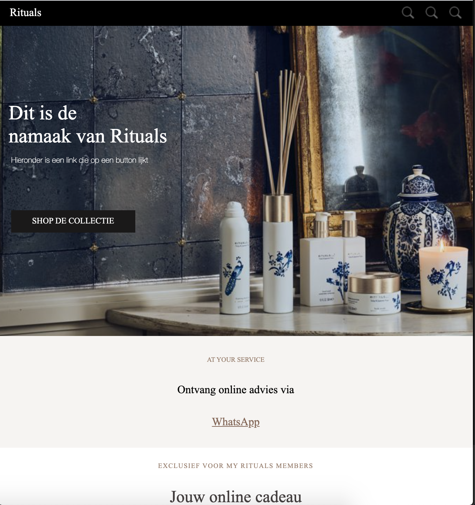
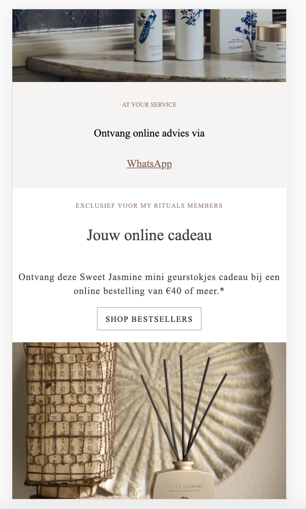
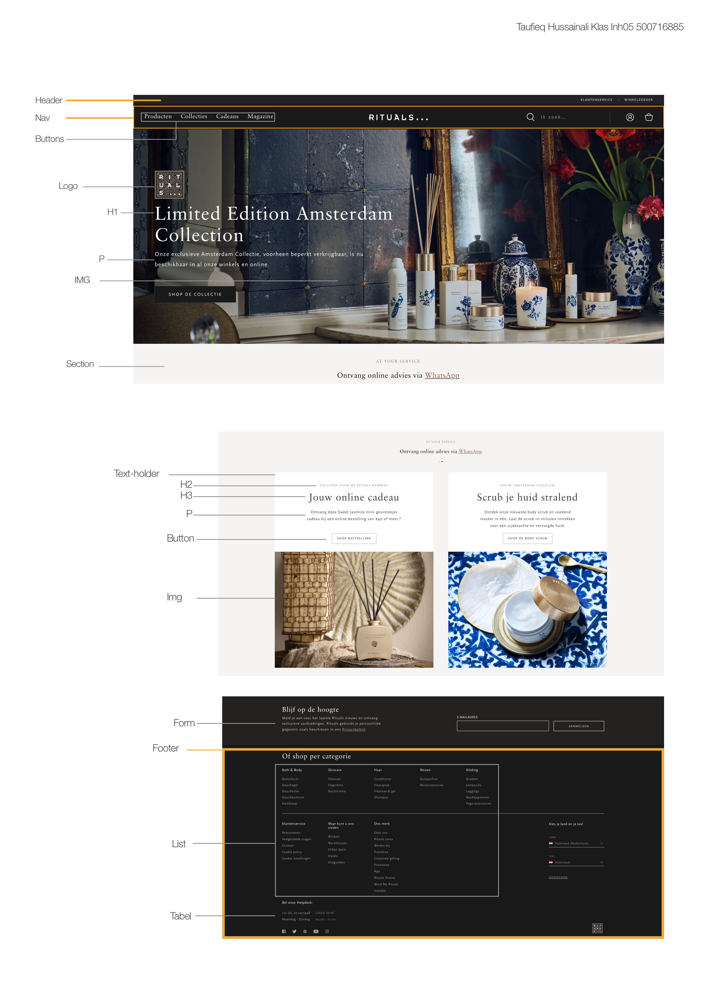

# Procesverslag
**Auteur:** -jouw naam-

Markdown cheat cheet: [Hulp bij het schrijven van Markdown](https://github.com/adam-p/markdown-here/wiki/Markdown-Cheatsheet). Nb. de standaardstructuur en de spartaanse opmaak zijn helemaal prima. Het gaat om de inhoud van je procesverslag. Besteedt de tijd voor pracht en praal aan je website.

## Bronnenlijst
1. -bron 1: bron voor de svg plaatsjes: http://svgicons.sparkk.fr/ -
2. -bron 2: https://codepen.io/shooft/pen/yLOvyQg-
3. -https://www.rituals.com/nl-nl/home-
4. -https://www.w3schools.com/html/html_forms.asp-
5. -https://css-tricks.com/snippets/css/a-guide-to-flexbox/-

## Eindgesprek (week 7/8)

-dit ging goed & dit was lastig-

**Screenshot(s): 

-screenshot(s) van je eindresultaat-

## Voortgang 3 (week 6)

-same as voortgang 1-

## Voortgang 2 (week 5)

-same as voortgang 1-

## Voortgang 1 (week 3)

### Stand van zaken

-dit ging goed & dit was lastig- 

Eigenlijk ging alles wel goed. Wat verwarrend was, is dat ik met flexbox werk en Rituals dingen zoals position absolute enzo gebruikt. Daardoor was het soms lastig om uit te zoeken hoe ik bepaalde elementen goed kon positioneren. 

Het is mij niet gelukt om foto's bij te snijden met css en flexbox. Wel met position absolute en left en right. 

Met behulp van de inspecterentool kon ik wel achterhalen hoe het een en ander gedaan is. Ik merk dat ik nog veel moet oefenen met Lineheight en letterspacing om zo het juiste gevoel na te bootsen. 
(images/Voortgang1.png)
(images/Voortgang1Mobiel.png)
**Screenshot(s):**

-screenshot(s) van hoe ver je bent-

### Agenda voor meeting

-samen met je groepje opstellen-

### Verslag van meeting

-na afloop snel uitkomsten vastleggen-

## Intake (week 1)

**Je startniveau:** -rood-

**Je focus:** -Responsive-

**Je opdracht:** -<https://www.rituals.com/nl-nl/home>-

**Screenshot(s):**

 
**Breakdown-schets(en):**

